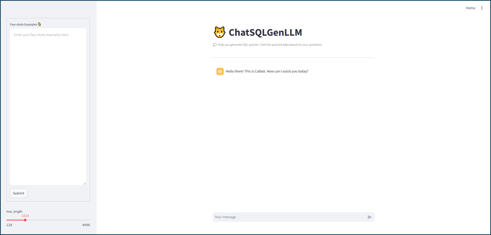

# ChatSQLGenLLM - 智能SQL查询生成系统

> **语言**: [English](README.md) | [中文](README.zh.md)


一个AI驱动的SQL查询chatbot，可以将自然语言转换为SQL查询并从数据库检索数据。



<br>

## ✨ 功能特点

- 🤖 **智能查询生成**: 使用最先进的SQLCoder模型将自然语言转换为SQL
- 🔍 **双重输出模式**: 生成SQL代码或直接返回查询数据
- 🖥️ **用户友好界面**: 使用Streamlit构建的交互式Web界面
- 🚀 **灵活架构**: 多种部署选项（直接集成或基于API）
- 📊 **数据库集成**: 支持SQLite和其他SQL数据库
- 🔧 **可定制性**: 可配置提示词、元数据和模型设置

<br>

## 🏗️ 系统架构

该系统提供三种不同的部署架构：

```
ChatSQLGenLLM/
├── locally_hosted_llm_directly_with_streamlit/     # 直接集成
│   ├── config.json                                 # 配置设置
│   ├── run_streamlit.py                            # 主应用程序
│   ├── prompt.md                                   # 提示词模板
│   ├── metadata.sql                                # 数据库架构
│   └── fewshots_examples.txt                       # 示例查询
├── locally_hosted_llm_fastapi_with_streamlit/      # 基于API的架构
│   ├── s1_build_local_api.py                       # FastAPI服务器
│   ├── s2_chatbot_call_api.py                      # Streamlit客户端
│   └── [配置文件]
└── remote_llm_api_with_streamlit/                  # 远程API集成
    ├── s1_call_remote_llm_api.php                  # PHP API客户端
    ├── s2_chatbot_call_api.py                      # Streamlit界面
    └── [配置文件]
```

<br>

## 🚀 快速开始

### 系统要求

- **操作系统**: Ubuntu 20.04（已测试）/ macOS
- **Python**: 3.9+
- **硬件**: 
  - GPU内存: 16GB × 2GPU（原始设置中的测试配置）
  - CPU内存: 8GB+
  - 存储空间: 20GB+ 可用空间

### 核心依赖

基于原始系统配置：

```
streamlit
transformers
torch
fastapi
sqlite3 (Python内置)
pandas
uvicorn
```

### 模型设置

该系统使用来自Hugging Face的**SQLCoder-7B-2**模型：

1. **下载模型**:
   ```bash
   # 访问: https://huggingface.co/defog/sqlcoder-7b-2
   ```

2. **模型信息**:
   - **模型**: [defog/sqlcoder-7b-2](https://huggingface.co/defog/sqlcoder-7b-2)
   - **架构**: 针对SQL生成优化的Code Llama微调模型
   - **性能**: 在复杂SQL查询和自然语言理解方面具有高精度

<br>

## 📖 部署选项

### 1. 🏠 直接集成（推荐初学者）

**locally_hosted_llm_directly_with_streamlit** - 简单的一体化解决方案

适合快速设置和测试。LLM模型直接在Streamlit应用程序中运行。

#### 配置

**第1步：配置设置**

编辑 `locally_hosted_llm_directly_with_streamlit/config.json`:

```json
{
    "model_path": "/path/to/sqlcoder-7b-2/",
    "prompt_file": "prompt.md",
    "metadata_file": "metadata.sql",
    "answer_mode": "code",
    "local_db_path": "/path/to/database.db"
}
```

- 配置选项：
  - **`model_path`**: 下载的SQLCoder模型目录的绝对路径
  - **`prompt_file`**: 用于构建LLM查询的模板文件（默认："prompt.md"）
  - **`metadata_file`**: 包含数据库架构信息的SQL文件（默认："metadata.sql"）
  - **`answer_mode`**: 
    - `"code"`: 仅返回生成的SQL查询代码
    - `"dataframe"`: 返回实际查询结果作为数据框（需要数据库连接）
  - **`local_db_path`**: 本地数据库文件路径（仅当answer_mode为"dataframe"时需要）

#### 启动应用程序

**第2步：启动服务**

```bash
cd locally_hosted_llm_directly_with_streamlit
streamlit run run_streamlit.py --server.address 127.0.0.1 --server.port 6006
```

**第3步：访问界面**

打开浏览器并导航到：[http://127.0.0.1:6006](http://127.0.0.1:6006)

> **注意**: 对于远程服务器部署，请确保配置了正确的端口转发。您可以根据需要自定义端口号。

<br>

### 2. 🔌 基于API的架构（推荐生产环境）

**locally_hosted_llm_fastapi_with_streamlit** - 可扩展的微服务方法

适用于生产环境，当您需要灵活性并且不想频繁重新加载模型时。

#### 优势：
- ⚡ **性能**: 模型在请求之间保持加载在内存中
- 🔄 **灵活性**: 重启Web界面而无需重新加载模型
- 🔧 **集成**: 易于与其他应用程序集成

#### 设置过程

**第1步：配置设置**

编辑 `locally_hosted_llm_fastapi_with_streamlit/config.json`:

```json
{
    "model_path": "/path/to/sqlcoder-7b-2/",
    "prompt_file": "prompt.md",
    "metadata_file": "metadata.sql",
    "answer_mode": "code",
    "local_db_path": "/path/to/database.db",
    "api_address": "http://127.0.0.1:8000"
}
```

- 配置选项：
  - **`model_path`**: 下载的SQLCoder模型目录的绝对路径
  - **`prompt_file`**: 用于构建LLM查询的模板文件（默认："prompt.md"）
  - **`metadata_file`**: 包含数据库架构信息的SQL文件（默认："metadata.sql"）
  - **`answer_mode`**: 输出格式（"code"用于SQL查询，"dataframe"用于结果）
  - **`local_db_path`**: 本地数据库文件路径（"dataframe"模式需要）
  - **`api_address`**: FastAPI服务器的URL（必须与服务器端口匹配）


**第2步：启动API服务器**

```bash
cd locally_hosted_llm_fastapi_with_streamlit
uvicorn s1_build_local_api:app --host 0.0.0.0 --port 8000 > uvicorn.log 2>&1 &
```

> **重要**: 确保端口与config.json中的`api_address`匹配

**第3步：启动Web界面**

```bash
streamlit run s2_chatbot_call_api.py --server.address 127.0.0.1 --server.port 6006
```

**第4步：访问应用程序**

在浏览器中打开 [http://127.0.0.1:6006](http://127.0.0.1:6006)

**第5步：停止服务**

停止API服务器：
```bash
lsof -ti:8000 | xargs kill
```

<br>

### 3. 🌐 远程API集成

**remote_llm_api_with_streamlit** - 连接到外部LLM服务

用于当您想使用外部服务而不是本地托管模型时，与基于云或远程LLM API集成。

#### 使用场景：
- 🌩️ **云集成**: 连接到基于云的LLM服务
- 💰 **成本优化**: 使用外部API避免本地GPU成本
- 🔧 **混合架构**: 将本地处理与远程AI服务相结合
- 📈 **可扩展性**: 利用云基础设施进行模型推理

#### 设置过程

**第1步：配置设置**

编辑 `remote_llm_api_with_streamlit/config.json`:

```json
{
    "prompt_file": "prompt.md",
    "metadata_file": "metadata.sql",
    "answer_mode": "dataframe",
    "local_db_path": "/path/to/local/database.db"
}
```

**第2步：配置PHP API客户端**

系统包含一个PHP脚本（`s1_call_remote_llm_api.php`），作为Streamlit界面和远程API之间的桥梁：

- 在PHP文件中更新API端点
- 如需要则配置身份验证
- 调整超时和错误处理设置

**第3步：启动服务**

```bash
cd remote_llm_api_with_streamlit
# 启动PHP服务器（如需要）
php -S localhost:8080 > php_server.log 2>&1 &

# 启动Streamlit界面
streamlit run s2_chatbot_call_api.py --server.address 127.0.0.1 --server.port 6006
```

**第4步：访问应用程序**

在浏览器中打开 [http://127.0.0.1:6006](http://127.0.0.1:6006)

> **注意**: 此架构需要运行中的远程LLM API服务和适当的网络连接。

<br>

## 🛠️ 高级配置

### 数据库架构设置

`metadata.sql`文件应包含您的数据库架构信息：

```sql
-- 示例 metadata.sql
CREATE TABLE users (
    id INTEGER PRIMARY KEY,
    name TEXT NOT NULL,
    email TEXT UNIQUE,
    created_at TIMESTAMP DEFAULT CURRENT_TIMESTAMP
);

CREATE TABLE orders (
    order_id INTEGER PRIMARY KEY,
    user_id INTEGER,
    product_name TEXT,
    quantity INTEGER,
    price DECIMAL(10,2),
    order_date DATE
);
```

### 提示词工程

自定义`prompt.md`文件以改善查询生成：

```markdown
### Task
Generate a SQL query to answer questions.

{examples}

### Database Schema
The query will run on a database with the following schema:
{table_metadata_string}

### Answer
Given the database schema, here is the SQL query that [QUESTION]{user_question}[/QUESTION]
[SQL]
```

### 少量示例

在`fewshots_examples.txt`中添加示例以提高模型性能：

```
Question: How many users registered last month?
SQL: SELECT COUNT(*) FROM users WHERE created_at >= DATE('now', '-1 month');

Question: What are the top 5 selling products?
SQL: SELECT product_name, SUM(quantity) as total_sold FROM orders GROUP BY product_name ORDER BY total_sold DESC LIMIT 5;
```

<br>

## 📝 许可证

该项目根据MIT许可证授权。详情请参阅[LICENSE](LICENSE)文件。